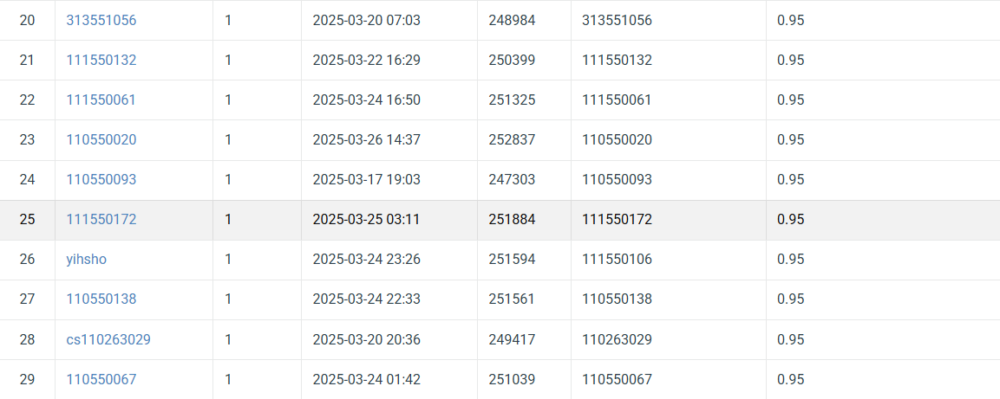

## NYCU Selected Topics in Visual Recognition using Deep Learning HW1
- Student ID: 111550172
- Name: 游承曦

### Introduction
I aim to leverage the powerful pre-trained ResNet models, including its variants and ResNeXt, to perform transfer learning. The implementation is primarily based on the 101-layer series and also incorporates a bagging ensemble method.

### Installation
```bash
git clone https://github.com/thomasyu9393/NYCU-VRDL.git
cd NYCU-VRDL/HW1
conda create -n hw1 python=3.9
conda activate hw1
conda install pytorch torchvision torchaudio pytorch-cuda=11.8 -c pytorch -c nvidia
conda install pandas loguru
```

### Performance Snapshot
<p align="center">
  
</p>