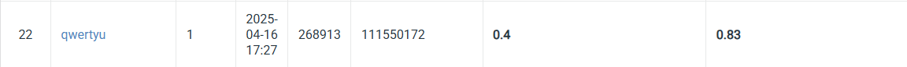

## NYCU Selected Topics in Visual Recognition using Deep Learning HW2
- Student ID: 111550172
- Name: 游承曦

### Introduction
In this assignment, the goal was to detect and classify digits within images. I trained several Faster R-CNN models and evaluated their performance using two key metrics: mean Average Precision (mAP) and accuracy. Additionally, I experimented with various techniques to improve model performance, including two-stage training, backbone selection, and tuning of score and IoU thresholds. Furthermore, I implemented ensemble methods to aggregate predictions from multiple models, using Non-Maximum Suppression (NMS) to eliminate redundant bounding boxes.

### Installation
```bash
git clone https://github.com/thomasyu9393/NYCU-VRDL.git
cd NYCU-VRDL/HW2
conda create -n hw1 python=3.9
conda activate hw1
conda install pytorch torchvision torchaudio pytorch-cuda=11.8 -c pytorch -c nvidia
pip install -r requirements.txt
```

### Training
```bash
python train.py --train --batch_size 4 --epochs 5 --ckpt_dir ckpt
```

### Testing
```bash
python train.py --test --batch_size 4 --ckpt ckpt/best_model.pth --zip_file ckpt/submission.zip
```

### Performance Snapshot
<p align="center">
  
</p>