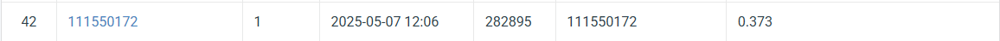

## NYCU Selected Topics in Visual Recognition using Deep Learning HW3
- Student ID: 111550172
- Name: 游承曦

### Introduction
This assignment focuses on instance segmentation of four types of cells using the Mask R-CNN model, which detects objects and generates pixel-level masks for each instance. In this assignment, I use Mask R-CNN as the baseline and experiment with different feature extractor backbones, such as ResNet50 and ResNeXt50. To better fit the shapes and sizes of the cells, I modify the anchor sizes and aspect ratios in the Region Proposal Network (RPN). I also adjust the maximum number of sampled instances per image to examine its impact on training.

### Installation
```bash
git clone https://github.com/thomasyu9393/NYCU-VRDL.git
cd NYCU-VRDL/HW3
conda create -n hw_env python=3.9
conda activate hw_env
conda install pytorch torchvision torchaudio pytorch-cuda=11.8 -c pytorch -c nvidia
pip install -r requirements.txt
```

### Training
```bash
python train.py
```

### Testing
```bash
python test.py --ckpt ./epoch_1.pth --out_dir tmp
```

### Performance Snapshot
<p align="center">
  
</p>